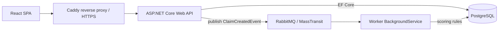

# ClaimFlow 
An insurance claims processing system: submit a claim, get it validated,
scored asynchronously and decided.


## Architecture



## Tech stack
```markdown
| Layer     | Technology                                    |
|-----------|-----------------------------------------------|
| API       | ASP.NET Core (.NET 9), FluentValidation       |
| Messaging | RabbitMQ via MassTransit                      |
| Data      | PostgreSQL, EF Core (code-first migrations)   |
| Worker    | .NET BackgroundService (MassTransit consumer) |
| Frontend  | React + TypeScript (Vite)                     |
| Infra     | Docker Compose, Caddy (reverse proxy, HTTPS)  |
| Tests     | xUnit                                         |
```
